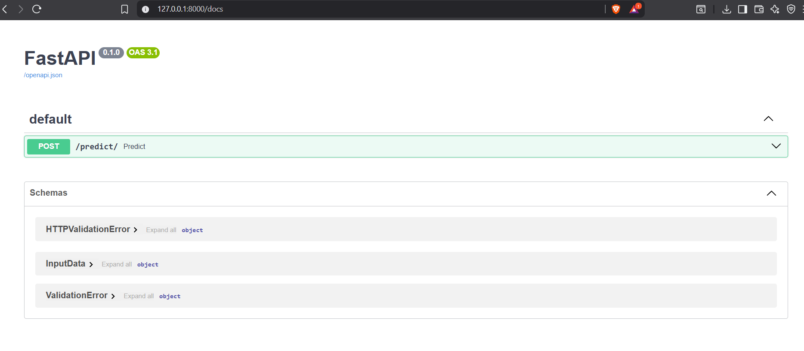
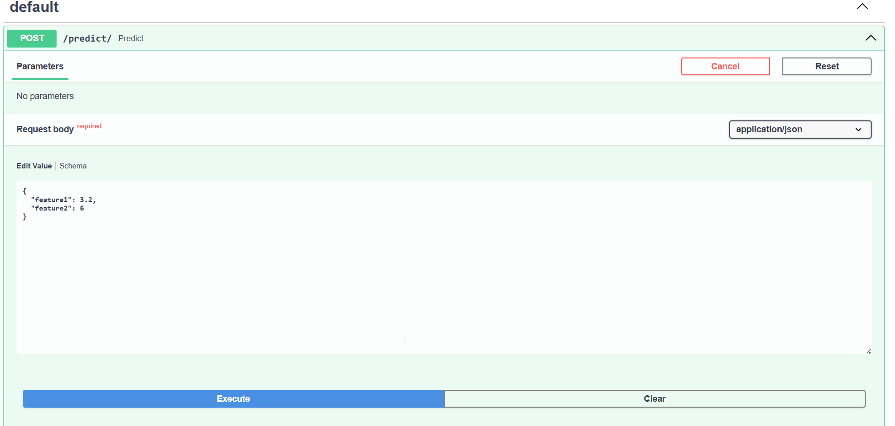

# Fuel Consumption Prediction API

A **FastAPI-based Machine Learning project** that predicts vehicle fuel consumption using a regression model trained on the [FuelConsumption dataset](https://www.kaggle.com/datasets/krupadharamshi/fuelconsumption).  

This project demonstrates the full pipeline — **data preprocessing, model training, serialization with Joblib, and API deployment** using FastAPI.

---

## Project Overview

This API allows users to input numeric vehicle parameters (like `engine size`, `cylinders`, or `CO2 emissions`) and get predicted fuel consumption values instantly.

### FastAPI Docs View


### Example Prediction


---

## Tech Stack

- **FastAPI** – Backend framework  
- **Scikit-learn** – Model training  
- **Joblib** – Model serialization  
- **Pydantic** – Data validation  
- **Uvicorn** – ASGI server for deployment  

---

## Project Structure

```
├── api.py             # FastAPI app
├── model/
│   └── model.pkl          # Trained model
├── notebook.ipynb
├── data/
│   └── FuelConsumption.csv
├── requirements.txt
└── README.md
```

---

##  API Endpoints

### **POST** `/predict/`

**Request Body**
```json
{
  "feature1": 5.3,
  "feature2": 120.5
}
```

**Response**
```json
{
  "prediction": 7.84
}
```

---

##  How to Run Locally

### 1️⃣ Clone the repo
```bash
git clone https://github.com/sameer-at-git/Fuel-Consumption-Prediction-API-using-Linear-Regression-and-FastAPI.git
cd Fuel-Consumption-Prediction-API-using-Linear-Regression-and-FastAPI
```

### 2️⃣ Create a virtual environment
```bash
python -m venv venv
source venv/bin/activate     # (Linux/Mac)
venv\Scripts\activate        # (Windows)
```

### 3️⃣ Install dependencies
```bash
pip install -r requirements.txt
```

### 4️⃣ Run the FastAPI app
```bash
uvicorn app.api:app --reload
```

Access the docs:  
👉 [http://127.0.0.1:8000/docs](http://127.0.0.1:8000/docs)

---
##  Model Training (Notebook)

The notebook [`notebook.ipynb`](notebook.ipynb) covers:
- Dataset exploration  
- Feature engineering  
- Model training & evaluation  
- Saving model using Joblib  

---

##  Deployment Ideas

- [Hugging Face Spaces](https://huggingface.co/spaces) (with FastAPI)
- [Render](https://render.com/)
- [Railway.app](https://railway.app/)
- [Vercel](https://vercel.com/) (with ASGI adapter)

---

## Author

**Md. Sameer Sayed**    
📧 [mdsameersayed0@gmail.com](mailto:mdsameersayed0@gmail.com)  
🌐 [GitHub](https://github.com/sameer-at-git)

---

## License
This project is released under the MIT License.
